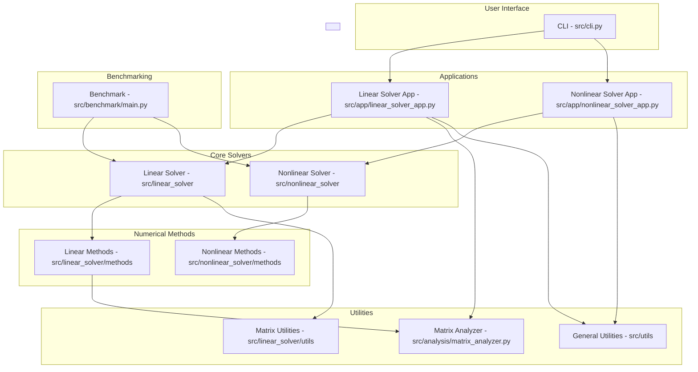

# Documentação Unificada - Métodos Numéricos para Sistemas Lineares e Não Lineares

## 1. Visão Geral do Projeto

Uma biblioteca Python abrangente para resolução de sistemas lineares e não lineares usando métodos numéricos, desenvolvida com foco em boas práticas de desenvolvimento de software.

### 1.1. Características

- **Métodos Lineares:**
  - **Iterativos Clássicos:** Jacobi, Gauss-Seidel.
  - **Alta Ordem:** Jacobi de Ordem 2, Gauss-Seidel de Ordem 2 (SOR).
  - **Gradiente:** Gradiente Conjugado, Gradiente Conjugado Quadrado (CGS), Gradiente Conjugado Precondicionado.
- **Métodos Não Lineares:**
  - Método de Newton-Raphson
  - Método da Iteração de Ponto Fixo
  - Método do Gradiente
- **Recursos:**
  - Carregamento de dados via CSV.
  - Análise e validação de propriedades de matrizes.
  - Monitoramento de convergência com histórico.
  - Geração de matrizes de teste.
  - Interface de linha de comando (CLI) robusta.
  - Qualidade de código garantida por formatadores, linters e testes.

## 2. Arquitetura da Aplicação

A aplicação é estruturada de forma modular para separar as preocupações e facilitar a extensibilidade.

- **Interface do Usuário (`src/cli.py`):** Ponto de entrada que interpreta comandos do usuário.
- **Aplicações (`src/app/`):** Orquestradores que gerenciam o fluxo de execução para solucionadores lineares e não lineares.
- **Solucionadores Core (`src/linear_solver`, `src/nonlinear_solver`):** Lógica de alto nível e interfaces base para os solucionadores.
- **Métodos Numéricos (`src/linear_solver/methods`, `src/nonlinear_solver/methods`):** Implementações concretas dos algoritmos.
- **Utilitários e Análise (`src/utils`, `src/analysis`):** Ferramentas de suporte para manipulação de dados, análise de matrizes e benchmarking.

### Diagrama da Arquitetura



## 3. Fundamentos Teóricos

### 3.1. Problemas Lineares

Um sistema de equações lineares pode ser representado como $\mathbf{A}\mathbf{x} = \mathbf{b}$. A solução pode ser encontrada por:

- **Métodos Diretos (ex: Eliminação de Gauss):** Solução exata em um número finito de passos.
- **Métodos Iterativos (ex: Jacobi, Gauss-Seidel):** Geram uma sequência de aproximações que convergem para a solução. São ideais para sistemas grandes e esparsos.

### 3.2. Problemas Não Lineares

Um sistema de equações não lineares é representado como $\mathbf{F}(\mathbf{x}) = \mathbf{0}$. A solução é mais complexa devido a desafios como múltiplas soluções e sensibilidade à estimativa inicial. Os métodos são inerentemente iterativos.

- **Método de Newton:** Lineariza o sistema a cada passo usando a matriz Jacobiana, oferecendo convergência quadrática.
  $$ \mathbf{x}_{k+1} = \mathbf{x}_k - [\mathbf{J}(\mathbf{x}_k)]^{-1} \mathbf{F}(\mathbf{x}_k) $$
- **Métodos de Iteração de Ponto Fixo:** Reescreve o sistema como $\mathbf{x} = \mathbf{G}(\mathbf{x})$ e itera $\mathbf{x}_{k+1} = \mathbf{G}(\mathbf{x}_k)$.
- **Métodos de Otimização (Gradiente):** Minimiza a função $g(\mathbf{x}) = \frac{1}{2} \mathbf{F}(\mathbf{x})^T \mathbf{F}(\mathbf{x})$ usando o método do gradiente.

## 4. Guia de Uso

### 4.1. Instalação

**Pré-requisitos:** Python 3.8+, Poetry.

```bash
# Clone o repositório
git clone https://github.com/Jootiinha/numerical-methods-for-pde.git
cd numerical-methods-for-pde

# Instale as dependências
poetry install --with dev,analysis

# Ative o ambiente virtual
poetry shell
```

### 4.2. Executando via Linha de Comando (CLI)

A aplicação é controlada pelo `main.py`.

- **Resolver todos os sistemas lineares:**
  ```bash
  python main.py --all
  ```
- **Resolver um sistema específico:**
  ```bash
  python main.py --jacobi --gauss-seidel --system "Sistema Brasileiro 36x36"
  ```
- **Executar benchmark de performance:**
  ```bash
  python main.py --benchmark
  ```
- **Resolver o sistema não linear:**
  ```bash
  python main.py --nonlinear
  ```
- **Gerar mapa de bacias de atração para o problema não linear:**
  ```bash
  python main.py --nonlinear --basin-map
  ```
- **Ver todas as opções:**
  ```bash
  python main.py --help
  ```

### 4.3. Uso como Biblioteca

Os componentes podem ser importados e usados em outros projetos.

**Exemplo (Solucionador Linear):**
```python
from src.linear_solver.methods.jacobi import JacobiSolver
from src.linear_solver.utils.csv_loader import CSVMatrixLoader

# Carregar dados
A, b = CSVMatrixLoader.load_augmented_matrix("data/your_system.csv")

# Resolver
solver = JacobiSolver(tolerance=1e-6)
x, info = solver.solve(A, b)

if info['converged']:
    print(f"Solução encontrada em {info['iterations']} iterações.")
```

**Exemplo (Solucionador Não Linear):**
```python
from src.nonlinear_solver.methods.newton import NewtonSolver
from src.nonlinear_solver.example import NonLinearSystemExample

# Definir o sistema e o jacobiano
def system_func(x):
    # ...
    pass

def jacobian_func(x):
    # ...
    pass

# Ponto inicial
x0 = [1.0, 1.0]

# Resolver
solver = NewtonSolver(tolerance=1e-8)
solution, info = solver.solve(system_func, jacobian_func, x0)
```

## 5. Resultados Numéricos

### 5.1. Sistemas Lineares

Para um sistema de teste com solução exata conhecida, os resultados foram:

| Método                | Iterações | Erro Final           |
| --------------------- | --------- | -------------------- |
| Jacobi                | 15        | $8.9 \times 10^{-6}$ |
| Gauss-Seidel          | 8         | $7.2 \times 10^{-6}$ |
| Gradiente Conjugado   | 4         | $1.2 \times 10^{-15}$|

O método do Gradiente Conjugado é notavelmente mais eficiente para sistemas adequados.

### 5.2. Sistemas Não Lineares

Para o sistema não linear implementado, o método de Newton demonstrou convergência quadrática, encontrando a solução com alta precisão em poucas iterações.

**Iterações do Método de Newton (Exemplo):**
| Iteração | Norma do Resíduo      |
|----------|-----------------------|
| 0        | 2.900                 |
| 1        | 1.321                 |
| 2        | 0.115                 |
| 3        | 0.001                 |
| 4        | $1.5 \times 10^{-7}$  |
| 5        | $3.9 \times 10^{-15}$ |

## 6. Guia de Desenvolvimento

### 6.1. Configuração do Ambiente

Após clonar o repositório, use o Poetry para instalar as dependências, incluindo as de desenvolvimento:
```bash
poetry install --with dev,docs,analysis
poetry shell
make pre-commit-install
```

### 6.2. Qualidade de Código

O projeto utiliza um conjunto de ferramentas para garantir a qualidade:
- `make format`: Formata o código com Black e isort.
- `make lint`: Executa verificações com flake8 e mypy.
- `make check`: Executa todas as verificações de formatação, linting e testes.

### 6.3. Fluxo de Contribuição

1. Crie uma branch para sua feature (`feature/nome-da-feature`).
2. Implemente a funcionalidade e adicione testes.
3. Execute `make check` para garantir que tudo está correto.
4. Faça o commit seguindo as convenções de commit (ex: `feat: Adiciona novo método`).
5. Abra um Pull Request.

## 7. Estrutura de Classes (Não Linear)

```mermaid
classDiagram
    class NonLinearSolver {
        <<abstract>>
        +solve(system_func, jacobian_func, x0) np.ndarray
        +get_method_name() str
    }

    class NewtonMethod {
        +solve(system_func, jacobian_func, x0) np.ndarray
        +get_method_name() str
    }

    class IterationMethod {
        +solve(system_func, jacobian_func, x0) np.ndarray
        +get_method_name() str
    }

    class GradientMethod {
        +solve(system_func, jacobian_func, x0) np.ndarray
        +get_method_name() str
    }

    NonLinearSolver <|-- NewtonMethod
    NonLinearSolver <|-- IterationMethod
    NonLinearSolver <|-- GradientMethod
